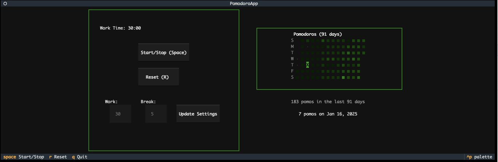
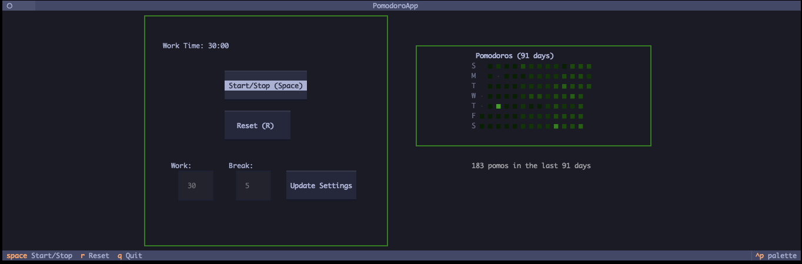
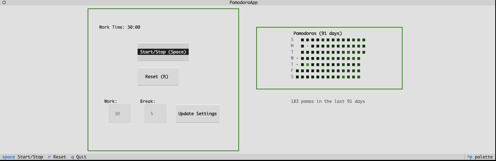
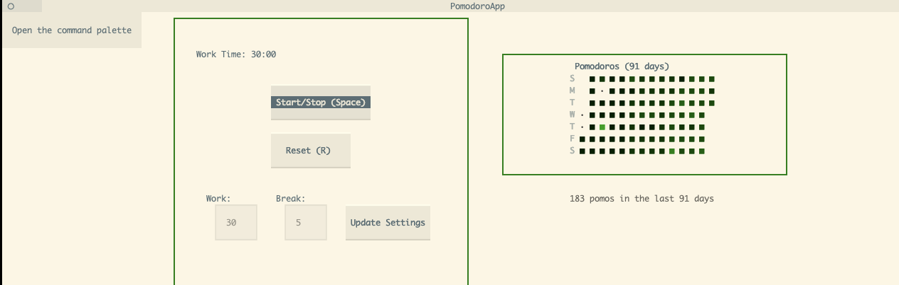
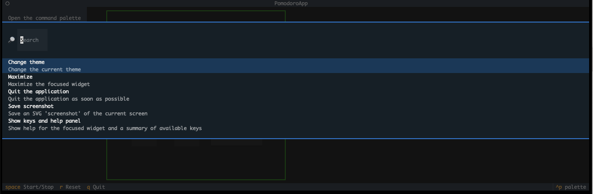

# Timy: Stay Focused in Your Terminal 👨‍💻🚀

<!-- Add Screenshot: Main Interface -->
*Replace this line with an image tag for your main app view.*
*Example: *

Stop context switching! 😩 Timy is a minimalist Pomodoro timer designed to keep you **in the zone** 🎯 without ever leaving your terminal. Built by devs, for devs, using Python 🐍 and the awesome [Textual](https://github.com/Textualize/textual) framework.

Boost your coding sprints 💨, manage your focus time ⏱️, and see your progress visually.

## ✨ Features
* **Terminal UI:** Clean, distraction-free interface 

* ⚙️ Adjust work/break durations (30/5 min default)
* 📈GitHub-style history graph shows your productivity
*  Full navigation without leaving the terminal 
* ⏰ Visual and sound alerts when sessions end
* 📝 Sessions automatically saved to `~/.timy/history.log`

## 🛠️ Installation

Get up and running quickly: 💨

**Requires:** ✅
*   Python 3.8+
*   `uv` (recommended for speed⚡) or `pip`
*   macOS (currently required for `afplay` sound notifications)

**Install from Source:** 📦

1.  Clone the repo (replace with your URL!):
    ```bash
    git clone https://github.com/yourusername/timy.git
    cd timy
    ```
2.  Install using `make` (recommended):
    ```bash
    # For regular use:
    make install 
    
    # OR for development (editable install):
    make develop
    ```
    *(This uses `uv` under the hood to create a `.venv` and install dependencies.)*

3.  Run it! 🎉
    ```bash
    # If you used 'make install' or 'make develop':
    # Activate the environment
    source .venv/bin/activate
    timy 
    ```

*(Homebrew formula planned! 🍻)*

## 🚀 Usage

Just run `timy` in your terminal.

<!-- Add Screenshot: Home screen -->







**Core Controls:** 🕹️
*   `Spacebar`: Start / Stop the current timer.
*   `R`: Reset the timer back to the work duration.
*   `Q`: Quit Timy.
*   Use the `Work:` / `Break:` inputs + `Update Settings` button to change durations.
*   Use `Ctrl + p` change themes, take screenshots, view help message or quit the application.


<!-- Using the menu  -->



**History Graph Navigation:** 📝
*   Focus the graph area (click / maybe Tab).
*   Use `Arrow Keys` (↑ ↓ ← →) to select a day.
*   Check the info line below the graph for details (`<n> pomos on <Date>`).


<!-- Add Screenshot: Graph Interaction -->
*Optionally replace this with a screenshot showing graph selection.*

## 🧑‍💻 Development & Contributing

Built with Python and Textual - feel free to dive in! 🤝

We use `make` for common tasks:

*   `make develop`: Install in editable mode (uses `uv`).
*   `make run`: Run the app after installing.
*   `make build`: Build source distribution and wheel (uses `uv`).
*   `make clean`: Remove build artifacts, caches, and `.venv`. 🧹
*   *(Placeholders for `make lint` / `make test` exist - add your tools!)*

**Contributions Welcome!** 🙌

1.  Fork the repo.
2.  Clone your fork.
3.  Create a feature/bugfix branch. (`git checkout -b cool-new-feature`)
4.  Code! ✨
5.  Push to your fork. (`git push origin cool-new-feature`)
6.  Open a Pull Request! 🙏

Found a bug 🐛 or have an idea 💡? Open an issue on the [GitHub Issues](https://github.com/yourusername/timy/issues) page (replace with your URL!).

## 📄 License

This project is licensed under the MIT License - see the LICENSE file for details. 
